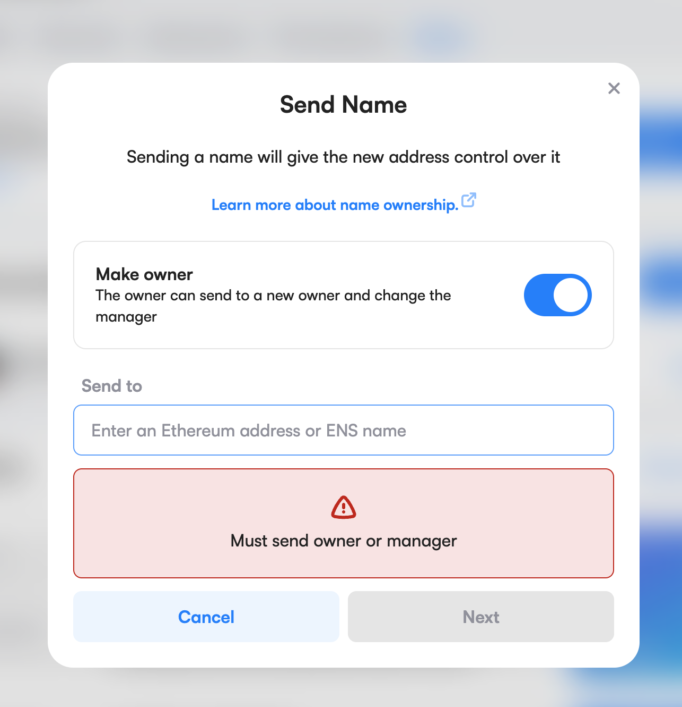

## Steps to deploy the NameWrapperProxy

1. Deploy the smart contract NameWrapperProxy and transfer ownership of the smart contract.
2. Transfer ens domain (2718.eth) to NameWrapperProxy address.




In case there is any error, you can always withdraw the ens domain from the NameWrapperProxy with the function "transferENSOwnership", only the owner of the smart contract can do this.

To check if the NameWrapperProxy contract owns the ens domain, look the ownership on OpenSea, it should match with the deployed address.

[ENS official deployed addresses](https://discuss.ens.domains/t/namewrapper-updates-including-testnet-deployment-addresses/14505)

To check if a subdomain is effectively assigned to an address go to the resolver contract and pass the node to the addr function.

## Install dependencies

```sh
forge install
```
## Development

```sh
forge build
```

### Run tests

```sh
forge test
```